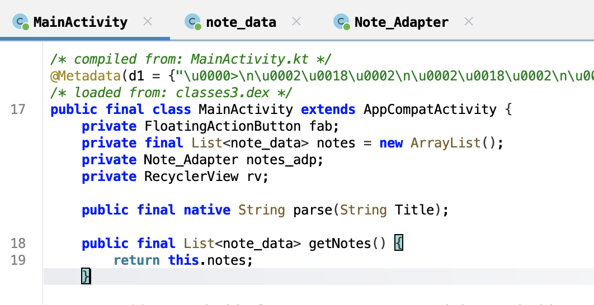
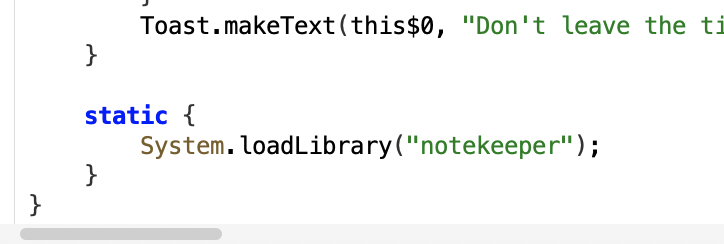
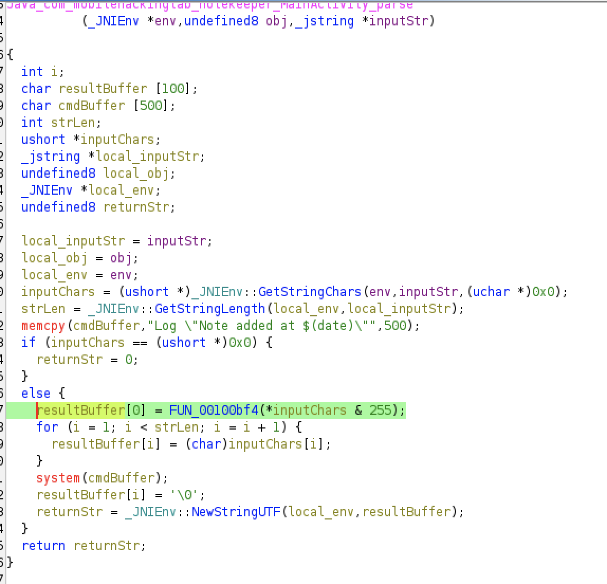

# Note Keeper - Buffer Overflow

I found a native stack buffer overflow in the Note Keeper challenge that lets me control the command string passed to `system()` from the app’s JNI code.

So the apk takes Title and Content as inputs, and passes the title to `parse()` which is a native function defined in the `libnotekeeper.so` file.


While poking around `MainActivity.parse()` in `libnotekeeper.so` I noticed it reads the Java title with `GetStringLength` / `GetStringChars` and copies the characters into a fixed `char resultBuf[100]`. Right next to that on the stack is a `char cmdBuf[500]` prefilled with the literal `Log "Note added at $(date)"`. The native code then calls `system(cmdBuf)`.
( i renamed the variables for my understanding )

Because there’s no bounds check, giving a long title overwrites `resultBuf`’s boundary and starts writing into `cmdBuf`. In this build `resultBuf` and `cmdBuf` are adjacent with no gap, so it’s trivial to corrupt the start of `cmdBuf`. I proved this in the emulator: a title long enough to overflow `resultBuf` into `cmdBuf` changed the stored command into a `log ...` invocation, which the emulator executed - I saw the message appear in `adb logcat`.

The payload I used was:
```
payload = "A"*100
payload += "log -t mytag \"SUIIIIIIIIIIIIIIIIIIIIIIIIIIIIIIIIIII\""
print(payload)
```

In short: I can overwrite the command buffer from the Java title and make the app run arbitrary shell commands via `system()` in that environment. For the CTF I used the `log` command as a harmless demonstration that command execution is possible; that proved the primitive end-to-end.

That’s the core - buffer overflow in native `parse()` → control bytes land in `cmdBuf` → `system()` executes the modified command. I captured the Ghidra stack frame showing `resultBuffer` at `sp-0x2a4` and `cmdBuffer` at `sp-0x240` (adjacent), plus `adb logcat` output showing the injected `log` message.

