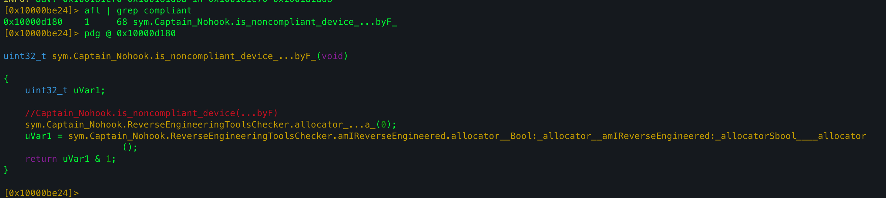
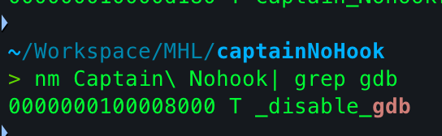
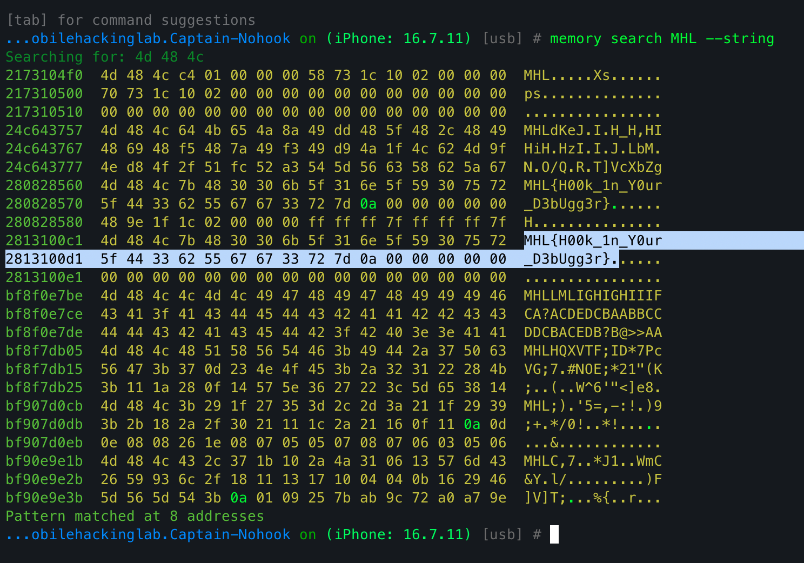

## Overview

This challenge was a classic mobile RASP / anti-reversing puzzle. 
**Goal: bypass the app’s reverse-engineering/compliance checks and find the hidden flag in memory.** 
combined **static analysis (radare2 / nm)** with **dynamic instrumentation (Frida)** and a little help from **Objection** for memory inspection.

---

# Steps I followed

## 1) Static discovery with r2 / nm

- I loaded the app binary into `r2` and searched for symbols/functions containing the term **`compliant`**. That quickly pointed me at the high-level check that decides whether the device is “noncompliant”.
    
- Using `nm` (and symbol enumeration in r2) I obtained the _full mangled symbol name_ for the function:
    
    which demangles to `Captain_Nohook.is_noncompliant_device() -> Swift.Bool`.
    
- While browsing the binary I also identified many other checks (functions) - checks for jailbroken environment, presence of suspicious files, open ports, DYLD-injected libraries, ptrace/pselect flags, etc. But all of them initiated through the `Captain_Nohook.is_noncompliant_device()` function.
    
---

## 2) Dynamic bypass using Frida

- I wrote a Frida script to neutralize (bypass) the checks at runtime.
    

### Bypassing `is_noncompliant_device`

- Since `is_noncompliant_device()` is a simple no-argument function returning a boolean, replacing it with a `NativeCallback` that returns false (0) is safe and straightforward.
    
    

### Why `Interceptor.replace` vs `Interceptor.attach`

- For small scalar-return functions (like `is_noncompliant_device`) replacement with an appropriate callback is safe.
    
- For functions that return structs or use indirect returns (Swift `String`, complex structs), replace is dangerous unless you exactly match ABI. For `disableGdb` the replacement was safe because I confirmed the target ABI and entry point before replacing.
    
- Where unsure, I prefer `Interceptor.attach` and do `onLeave` modifications (less likely to crash the process).
    

---

## 3) Searching memory for the flag

- After disabling the checks, I used **Objection** to scan the app memory for likely flag strings. At first Objection failed to run, I spent alot of time struggling to find the issue. Then i found a function `disableGdb`.
- 
#### Dealing with non-exported functions (`disableGdb`)

- I found a `disableGdb` routine that tries to detect or disable debuggers. It wasn’t exported, so I couldn’t call it by name.
    
- Solution: compute the function address as `module_base + hardcoded_offset` (I discovered the offset from my static analysis and verified module base at runtime). Then replace the function body with a tiny `NativeCallback` (an empty function) to neutralize its behavior.


---

# Final Frida script

```js
var disableGdbOffset = 0x8000;
var disableGdb = Process.getModuleByName("Captain Nohook").base.add(disableGdbOffset);
var newFunc = new NativeCallback(
  function () {
    console.log("[+] Bypassed gdb check");
  },
  "void",
  []
);

Interceptor.replace(disableGdb, newFunc);

const address = Module.findExportByName(null, "$s14Captain_Nohook22is_noncompliant_deviceSbyF");
if (address){
  Interceptor.replace(address, new NativeCallback(()=>{
    console.log(`[+] Bypassed Compliant Check`);
    return 0;
  }, 'int', []));
};
```

---

# Results

- The bypass successfully neutralized the app’s compliance and debugger checks at runtime.
    
- With the protections removed, Objection was able to enumerate memory and locate candidate strings. I then decoded/inspected candidate memory regions to find the hidden flag.
    

---