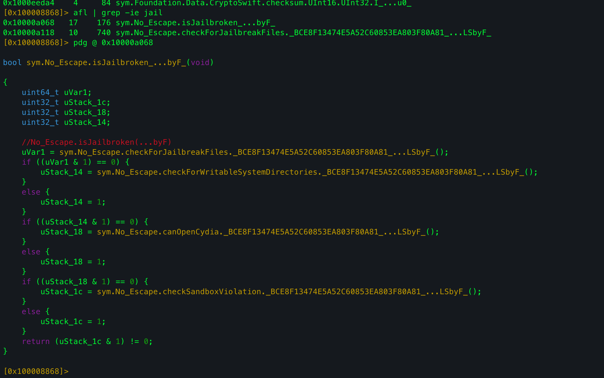
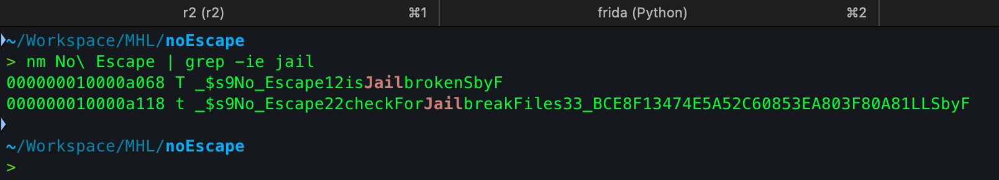
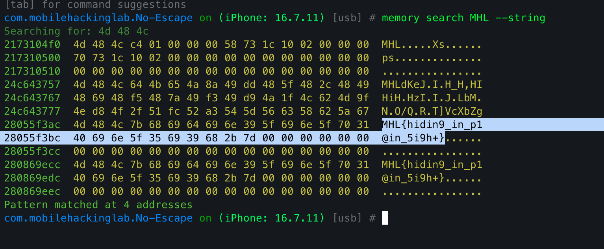

## Overview

This was a simple jail break detection bypass challenge. I downloaded the `ipa` extracted it and analyzed the binary with radare2. I found few jail break detection methods:





But all of them were being called inside a main detection function. Found its full mangled name using `nm`:



Then just wrote a simple frida script to hook and replace the contents, bypassing all the logic.

### script.js
```js
const address = Module.findExportByName(null,"$s9No_Escape12isJailbrokenSbyF");

if (address){

console.log("[+] Found the function: ", address);

console.log("[+] Hooking. . . .");

Interceptor.replace(address, new NativeCallback(()=>{

console.log("[+] Bypassed!");

return 0;

},'int',[]));

};
```


### Flag
Upon bypassing the checks, we get the flag on the UI. But im too lazy to write it word by word so i decided to find the flag in the memory using objection.



`MHL{hidin9_in_p1@in_5i9h+}`

